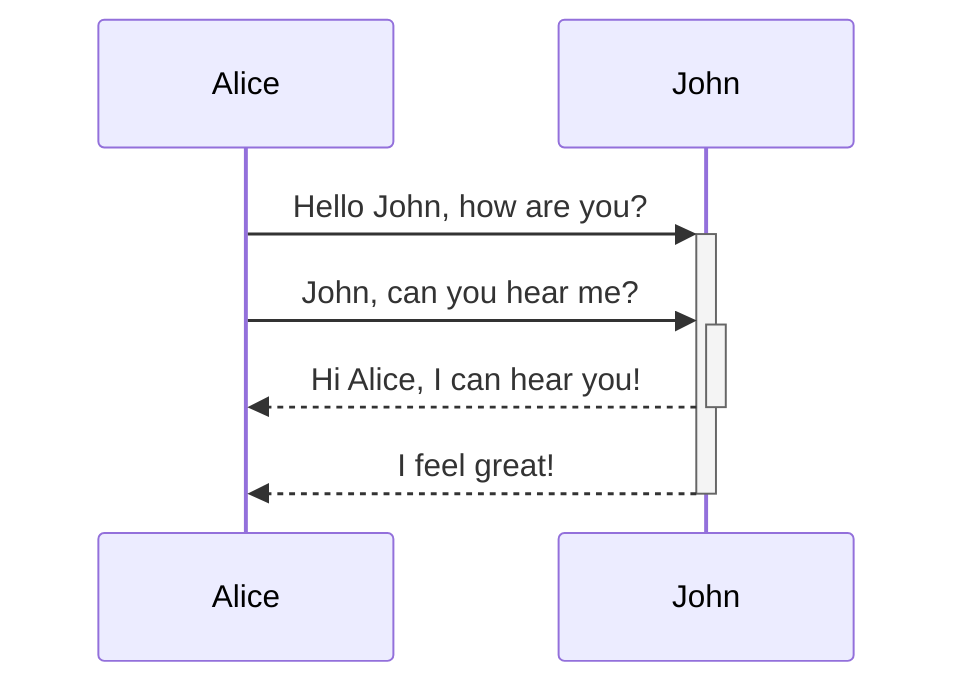
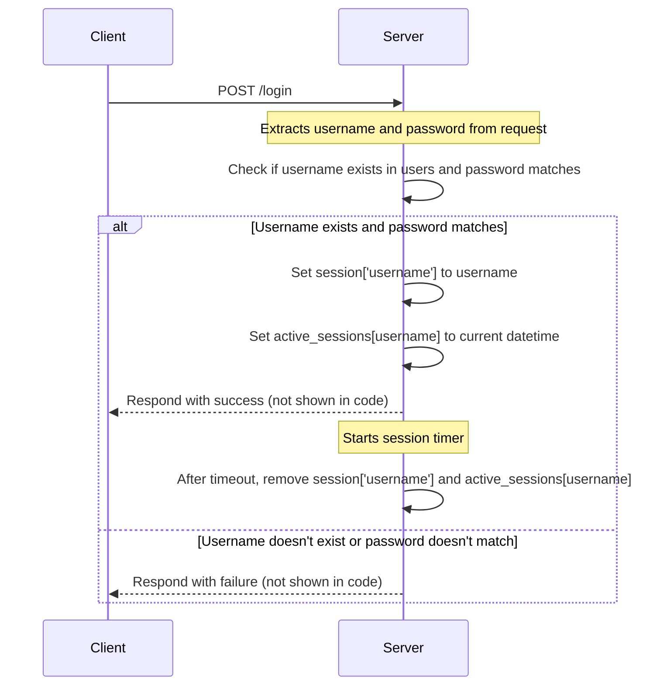
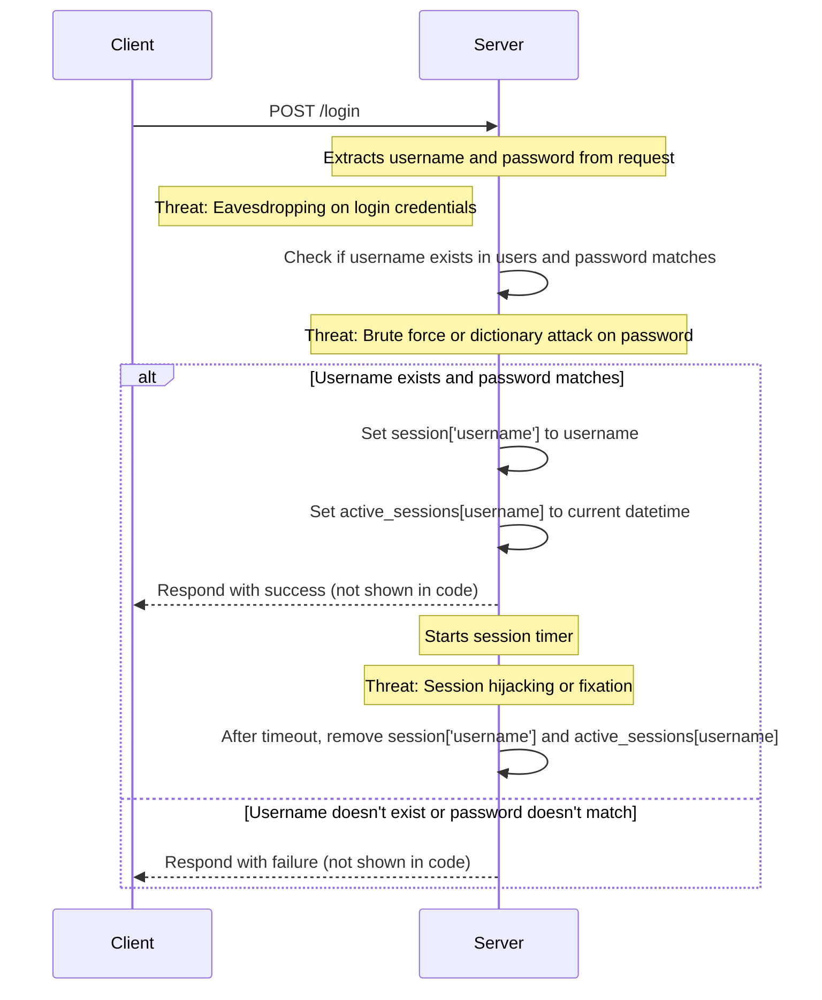

# Sequence Diagram for Broken Authentication

Here I'm going to show you a sequence diagram for the login process in the broken authentication example. This will help us understand the flow of the login process and also help us identify potential threats. The diagrams are presented in [Mermaid](https://mermaid.live/) format, which is a simple way to create diagrams using text. Github Markdown supports Mermaid diagrams, so you can see the diagrams directly in this file.

The diagrams were created by VS Code Copilot with a simple prompt: `make me a sequence diagram for the login process.`

# What's a Sequence Diagram

It is a graphical representation of the sequence of interactions among different objects in a system over time. It depicts object interactions arranged in time sequence, which can help visualize the flow of control in a system from start to end.

Because these sequences are typically very logical controls flows, they are typically fairly easy for AI assistants to generate. However, always check the results, as AI is highly prone to errors!

# Sequence Diagram for Broken Authentication

Here a sequence diagram of the login process as written in the code, [`broken-auth.py`](./broken-auth.py). Here the Client is the running application on your machine and the Server is the Flask server running `localhost`.

Here's the same diagram added but with threat modeling. If you aren't familiar with threat modeling, it's a process of identifying potential threats to a system and then mitigating them. It's a key part of the security development lifecycle, but can also be done as part of a penetration testing exercise.

