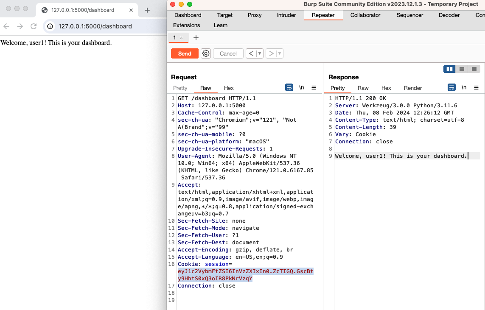
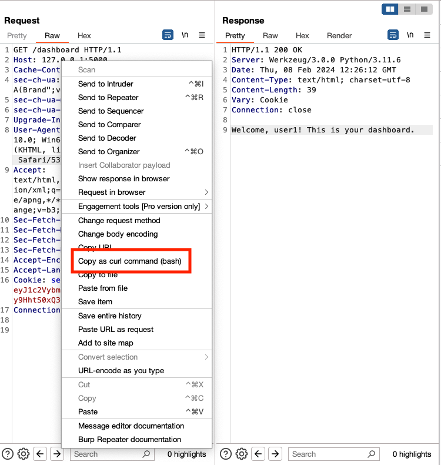

This walkthrough provides a simple demonstration of Session Hijacking - or stealing a user's session cookie to impersonate them. For more details see [OWASP Session Hijacking Attack](https://owasp.org/www-community/attacks/Session_hijacking_attack).

This demonstration uses the [Flask framework](https://flask.palletsprojects.com/en/3.0.x/), a lightweight web framework for Python. 

## Walkthrough

1. In the `broken-auth` directory, run the `broken-auth.py` script to start the server.

    ```bash
    python3 broken-auth.py
    ```

It should look like this in your terminal:

```bash
% python3 broken-auth.py
 * Serving Flask app 'broken-auth'
 * Debug mode: on
WARNING: This is a development server. Do not use it in a production deployment. Use a production WSGI server instead.
 * Running on http://127.0.0.1:5000
Press CTRL+C to quit
 * Restarting with stat
 * Debugger is active!
 * Debugger PIN: 490-867-972
```

2. Open Burp Suite and configure your browser to use the Burp proxy.

3. Open the web browser that is proxied through Burp and navigate to `http://127.0.0.1:5000/`.

4. Login with the following credentials:

- Username: `user1`
- Password: `password`

5. Assuming you have logged in successfully, send the `/dashboard` request to Burp Repeater.

6. In Burp Repeater, send the `/dashboard` request and observe the response. You should see a `Set-Cookie` header in the response. This is the session cookie that is used to authenticate the user.



7. Right-click on the request and choose `copy as cURL command`:



8. Open a new terminal and paste the cURL command. You can now impersonate this 

```bash
curl -i -s -k -X $'GET' \
    -H $'Host: 127.0.0.1:5000' -H $'Cache-Control: max-age=0' -H $'sec-ch-ua: \"Chromium\";v=\"121\", \"Not A(Brand\";v=\"99\"' -H $'sec-ch-ua-mobile: ?0' -H $'sec-ch-ua-platform: \"macOS\"' -H $'Upgrade-Insecure-Requests: 1' -H $'User-Agent: Mozilla/5.0 (Windows NT 10.0; Win64; x64) AppleWebKit/537.36 (KHTML, like Gecko) Chrome/121.0.6167.85 Safari/537.36' -H $'Accept: text/html,application/xhtml+xml,application/xml;q=0.9,image/avif,image/webp,image/apng,*/*;q=0.8,application/signed-exchange;v=b3;q=0.7' -H $'Sec-Fetch-Site: none' -H $'Sec-Fetch-Mode: navigate' -H $'Sec-Fetch-User: ?1' -H $'Sec-Fetch-Dest: document' -H $'Accept-Encoding: gzip, deflate, br' -H $'Accept-Language: en-US,en;q=0.9' -H $'Connection: close' \
    -b $'session=eyJ1c2VybmFtZSI6InVzZXIxIn0.ZcTIGQ.GscBty9HhtS0xQ3oIR8PkNrVzqY' \
    $'http://127.0.0.1:5000/dashboard'
```

If you see this message, you successfully got the user's session token:

`Welcome, user1! This is your dashboard.`