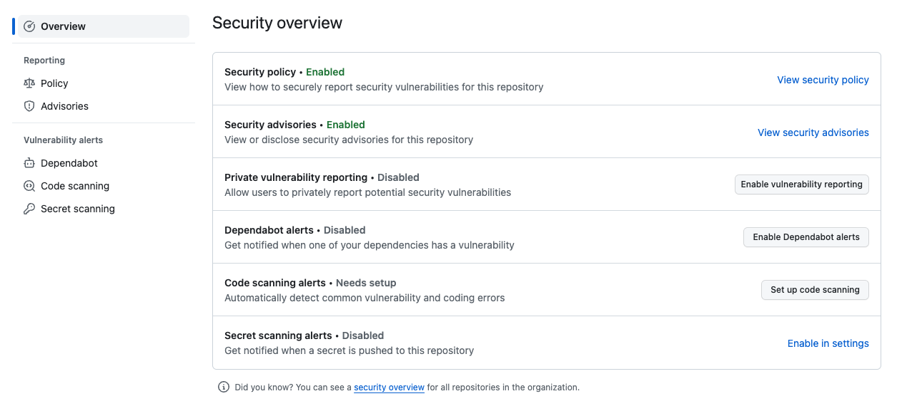
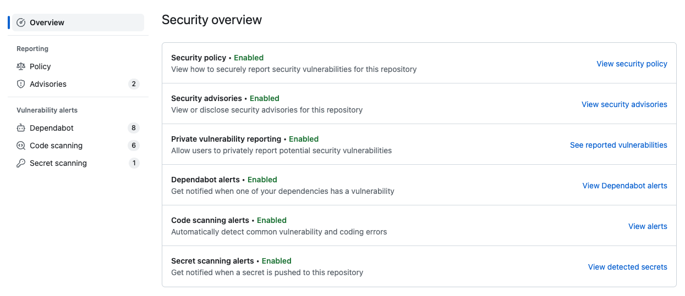

# Summary

This repository massages most of the Github Advanced Security (GHAS) features into a single repository: 

* Dependabot alerts
* Secrets scanning
* Code scanning with CodeQL
* Security advisories
* Security policy

When you fork a repository, all GHAS features are disabled by default. Hence, this repo serves as a good way to toggle most of the features of GHAS yourself and walk through some of the existing configurations.

# Goals

You should get core security configuration of the main features of Github Advanced Security. You be able to configure all scanning features and understand basic configuration options, code scanning actions, and YAML config options. 

You should be able to see security alerts and be able to triage and respond to them.

# Requirements

If you fork this repository in a public account, you will have access to all the features in this exercise. GHAS is free on public accounts. See also [GHAS pricing](https://docs.github.com/en/enterprise-cloud@latest/billing/managing-billing-for-github-advanced-security/about-billing-for-github-advanced-security)

# Set-up

1. Fork this repository to your own account. **NOTE** Make sure for fork this to your own account and not one part of an enterprise org. Forking to an enterprise org may cause unnecessary security alerts depending on how they are monitored.
2. Navigate to `https[X]://github.com/{your account id}/swiss-cheese/settings/security_analysis`. You will see the unset security settings:

# Configure the settings

Please see [GHAS Exercises Checklist](./ghas-checklist.md) for more details on how to configure each of the GHAS features. There are numerous links to documentation to help you interact with each security feature.

# Results

If you have the configured everything correctly you should have the same security alerts as the public repository your forked from. The exception is the Security Advisories, where are not copied to a forked repository.

# References

* [GHAS Developer Training](https://github.com/services/ghas-developer-training) - An outline of the core concepts suggested by GitHub.